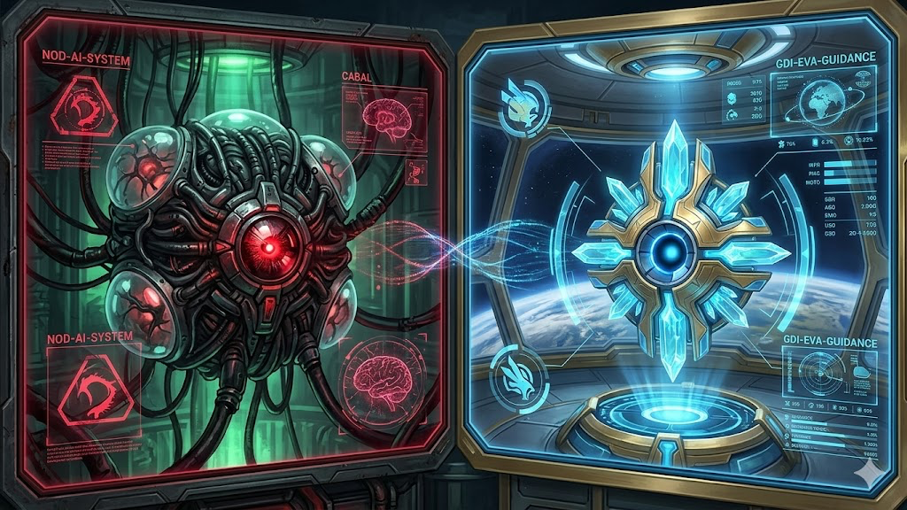

# Tiberian Sun Audio Hooks

> **📦 Moved — this repo is archived (read-only).**
> The Tiberian Sun packs and their extraction pipeline now live in
> **[claude-audio-hooks](https://github.com/samhayek-code/claude-audio-hooks)**,
> the single monorepo for all packs (StarCraft 2 · Halo · Tiberian Sun).
> Install from there:
> `bash <(curl -fsSL https://raw.githubusercontent.com/samhayek-code/claude-audio-hooks/main/install.sh)`



Command & Conquer: Tiberian Sun voice-line sound packs for Claude Code event hooks.
Sibling to [`claude-audio-hooks`](https://github.com/samhayek-code/claude-audio-hooks)
(StarCraft 2) and [`halo-audio-hooks`](https://github.com/samhayek-code/halo-audio-hooks) —
shares the same scripts and the live install at `~/.claude/sounds/`. Install the base, drop
these packs in alongside, switch freely.

Each pack blends its faction's announcer with its unit voices, the way the game layers them:
**GDI** runs EVA and her infantry; **NOD** runs CABAL and his cyborgs. 40 lines per pack, fired
at random.

## Install

Standalone — no other repo required (macOS; uses `afplay`). One-liner:

```bash
bash <(curl -fsSL https://raw.githubusercontent.com/samhayek-code/tiberian-sun-audio-hooks/main/install.sh)
```

Or clone and run `./install.sh`. It deploys the packs + scripts to `~/.claude/sounds/`,
merges the event hooks into `~/.claude/settings.json` (backed up first), and lets you pick a
starting voice. Start a new Claude Code session to hear it. Remove with `./uninstall.sh`.

Installs **additively** — if the SC2 or Halo packs are already there, this drops in alongside
and you switch across all of them with `set-faction.sh`. Uninstalling Tiberian Sun leaves the
others and the shared hooks intact.

## Packs

| Pack | Voices | Sample |
|------|--------|--------|
| `gdi` | EVA announcer + GDI units (infantry, engineer) | *"Construction complete." · "Ion cannon ready." · "Awaiting orders." · "Medic!"* |
| `nod` | CABAL + Nod units (cyborg, commando) | *"Your probability of success is insignificant and dropping." · "By your command." · "I can smell their fear."* |

Each pack is a folder of four event buckets: `session-start`, `task-complete`,
`needs-permission`, `error`. `play-random.sh` picks a random clip from the active pack's
bucket on each event.

The mapping leans into each voice. `needs-permission` gets the units literally awaiting your
command — GDI's *"Awaiting orders" / "Sir?"*, Nod's cyborg *"By your command."* `error` gets
panic and menace — *"Medic!"*, *"I'm taking heavy fire!"*, CABAL's *"Prepare for sterilization."*
CABAL has no congratulatory line, so on `task-complete` he turns dark-ironic (*"Defeat of enemy
predicted in T-minus 3, 2, 1."*) while his cyborgs report *"Executing."*

## Use

```bash
~/.claude/sounds/set-faction.sh gdi      # GDI EVA
~/.claude/sounds/set-faction.sh nod      # CABAL (Nod AI)
~/.claude/sounds/set-faction.sh protoss  # back to SC2, if installed
```

`set-faction.sh` auto-discovers any pack folder in `~/.claude/sounds/`, so SC2, Halo, and
Tiberian Sun packs coexist; the `active` symlink selects which one plays.

## Extraction pipeline (`tools/`)

These clips are the original game audio, extracted on macOS without Windows tools (no XCC
Mixer). The flow, end to end:

1. **Source** — the [CnCNet TS client package](https://github.com/CnCNet/cncnet-ts-client-package)
   ships the game's `Speech01.mix` / `Speech02.mix` as loose files (Tiberian Sun has been EA
   freeware since 2010).
2. **`extract_mix.py`** — parses the Westwood "new format" MIX archive (unencrypted: `u32`
   flags, `u16` count, `u32` body size, then a `{id, offset, size}` index) and pulls each
   entry as a raw Westwood `.AUD`.
3. **`hashtest.py`** — recovers canonical filenames. Each mix embeds an XCC Local Mix Database
   listing the original names; hashing each name (CRC32 of the uppercased name, padded with a
   count byte + repeated character when not 4-byte aligned) maps it back to an index id. The
   `i`/`n` letter in the name splits GDI from Nod.
4. **AUD → WAV** — `ffmpeg` decodes Westwood ADPCM directly (`wsaud` demuxer, `adpcm_ima_ws`
   decoder). `-fflags +discardcorrupt` silences a benign tail-block warning.
5. **Labeling** — [whisper.cpp](https://github.com/ggerganov/whisper.cpp) transcribes the full
   306-line corpus so the right lines can be sorted into event buckets.
6. **`build_pack.sh`** — per `gdi.manifest` / `nod.manifest`: trim silence, normalize
   loudness, add click-guard fades, encode to mp3.

Requires `ffmpeg` and (for labeling) `whisper-cpp`.

## Credits

- Voice clips and franchise © Electronic Arts / Westwood Studios
- Game data via the [CnCNet](https://cncnet.org/tiberian-sun) community client (EA freeware)
- Transcription by [whisper.cpp](https://github.com/ggerganov/whisper.cpp)
- Cover art is AI-generated fan art

## License & disclaimer

MIT — **the code and tooling, not the audio**. The Tiberian Sun voice clips are the property
of Electronic Arts / Westwood Studios and are included here for personal, non-commercial, fan
use only. This project is unofficial and not affiliated with or endorsed by EA. If you
represent a rights holder and want clips removed, open an issue and they'll be taken down.
